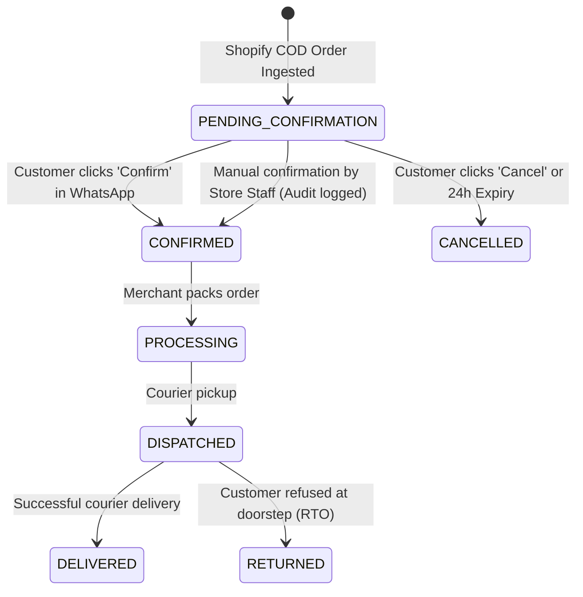

# ByteForge Omni-Commerce — System Architecture

## 1. System Overview

ByteForge Omni-Commerce is an enterprise-grade automated WhatsApp order confirmation SaaS designed for Shopify merchants running Cash-on-Delivery (COD) operations. It automates customer outreach, obtains verified confirmation or cancellation via WhatsApp interactive messages, and updates order states automatically in real-time.

```
+-----------------------------------------------------------------------------------+
|                                 ECOSYSTEM ARCHITECTURE                            |
+-----------------------------------------------------------------------------------+

       [Shopify Store]                                   [Meta WhatsApp Cloud API]
              │ (orders/create webhook)                             │ (interactive webhook)
              ▼                                                     ▼
+───────────────────────────+                         +───────────────────────────+
|   Raw HMAC Ingestion      |                         |  SHA-256 Webhook Receiver  |
+───────────────────────────+                         +───────────────────────────+
              │                                                     │
              ▼                                                     ▼
+─────────────────────────────────────────────────────────────────────────────────+
|                         BYTEFORGE BACKEND API SERVICE                           |
|                       (Node.js / Express / TypeScript)                          |
|                                                                                 |
|  • Webhook Idempotency Check (composite unique constraint on webhookId)         |
|  • Multi-Tenant Isolation Enforcement (all queries scoped by tenantId)           |
|  • Order Confirmation State Machine (PENDING -> CONFIRMED / CANCELLED)           |
|  • Meta Graph API Client (v21.0 Interactive Buttons & Utility Templates)       |
|  • Audit Logging Engine (tracks all automatic & manual status modifications)    |
+─────────────────────────────────────────────────────────────────────────────────+
              │                                                     ▲
              ▼                                                     │
+───────────────────────────+                         +───────────────────────────+
|   PostgreSQL Database     |                         |   Frontend Web / Mobile   |
|   (Northflank Sandbox)    |                         |  (Next.js App Router/     |
|   • Normalized models     |                         |   Capacitor for iOS IPA)  |
|   • Strict Decimal types  |                         +───────────────────────────+
+───────────────────────────+
```

## 2. Core Entities & Relationships

| Entity | Primary Key | Critical Constraints | Purpose |
| :--- | :--- | :--- | :--- |
| **Tenant** | UUID | `slug` (unique) | Multi-tenant root isolation boundary |
| **User** | UUID | `email` (unique), scoped to tenant | Staff & store owners |
| **ShopifyIntegration** | UUID | `tenantId`, `shopDomain` (unique) | Encrypted token & webhook secrets |
| **WhatsAppIntegration** | UUID | `tenantId`, `phoneNumberId` | Meta Cloud API credentials & tokens |
| **Customer** | UUID | `[tenantId, phoneNumber]` (unique) | E.164 normalized customer records |
| **Order** | UUID | `[tenantId, shopifyOrderId]` (unique) | Core COD order lifecycle entity |
| **OrderItem** | UUID | FK to `Order` | Line items with decimal price precision |
| **WhatsAppMessage** | UUID | `wamid` (unique) | Inbound/outbound message log & status |
| **WebhookEvent** | UUID | `[source, webhookId]` (unique) | Idempotent event ledger |
| **AuditLog** | UUID | Indexed by `tenantId`, `orderId` | Tamper-evident operational audit trail |

## 3. Order Confirmation State Machine



## 4. Security & Compliance

1. **HMAC Webhook Verification:**
   - Raw byte buffer is captured during body parsing (`req.rawBody`).
   - Shopify webhooks are verified using `crypto.createHmac('sha256', secret).update(rawBody).digest('base64')`.
   - Meta webhooks are verified using SHA-256 signature matching against `X-Hub-Signature-256`.

2. **Secret Encryption at Rest:**
   - All OAuth access tokens for Shopify and Meta Cloud API are encrypted with AES-256-GCM before database insertion.
   - Decryption keys are stored strictly in server environment variables and never logged or sent to the frontend.

3. **Tenant Boundary Enforcement:**
   - Every database query checks `where: { tenantId }`. No un-scoped queries are permitted.
